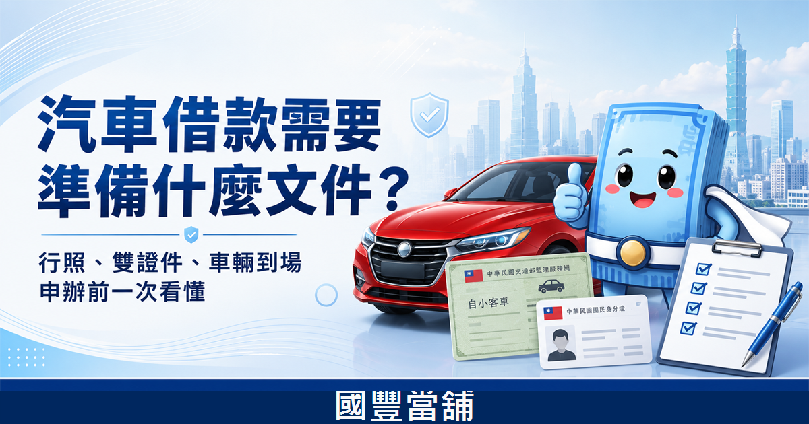
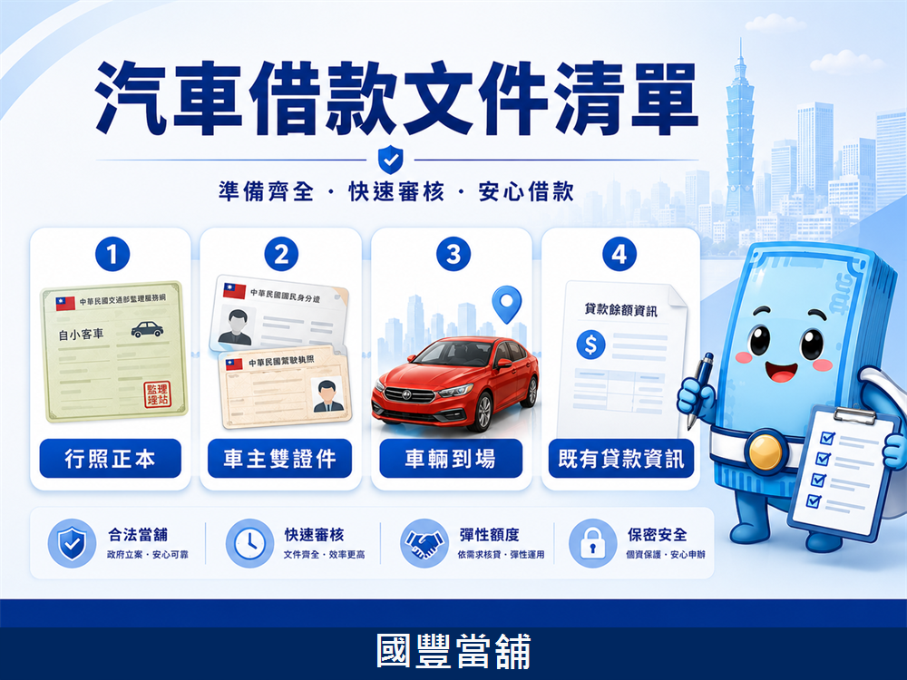

# 審稿稿件 001：汽車借款需要什麼文件？

狀態：待業主審稿  
建議分類：汽車借款  
最後更新：2026-07-04  
建議 URL：`/knowledge/car-loan-documents`  

## SEO 設定

Meta Title：汽車借款需要什麼文件？行照、雙證件與車輛到場說明｜國豐當舖

Meta Description：汽車借款通常需準備行照、車主雙證件，並由車主與車輛到場評估。本文整理申辦前文件、流程、費用與注意事項，實際條件以現場評估與契約為準。

焦點關鍵字：汽車借款需要什麼文件

次要關鍵字：

- 汽車借款
- 汽車借款文件
- 台北汽車借款
- 汽車借款行照
- 車主雙證件
- 免留車汽車借款

內部連結建議：

- `/services/car-loan`：汽車借款服務頁
- `/apply`：線上諮詢表單
- `/contact`：聯絡國豐當舖

外部來源建議：

- 全國法規資料庫：當舖業法
- 臺北市動產質借處：借款、利息與質借說明

## 圖片審稿

圖 1 封面圖：`/assets/knowledge/car-loan-documents-hero.png`

ALT：汽車借款需要準備什麼文件，行照、雙證件與車輛到場說明，國豐當舖

圖 2 內文清單圖：`/assets/knowledge/car-loan-documents-checklist.png`

ALT：汽車借款文件清單，行照正本、車主雙證件、車輛到場與既有貸款資訊

圖 3 文末 CTA 圖：`/assets/knowledge/car-loan-documents-cta.png`

ALT：想先確認車況與可評估方向，準備行照與雙證件由國豐當舖協助說明

圖片方向：每篇 GEO 文章固定使用 3 張圖，分別對應封面、內文重點整理、文末 CTA。三張圖均已加上底部「國豐當舖」浮水印，降低同行盜圖風險；浮水印不放地址與電話。






## 文章正文草稿

# 汽車借款需要什麼文件？行照、雙證件與車輛到場說明

汽車借款通常需要準備行照正本、車主本人雙證件，並由車主與車輛到場評估。可討論金額、利息、費用與撥款時間，會依車況、權屬、既有貸款、文件完整度與現場契約為準。

如果您只是想先知道「能不能辦」，不用一開始就整理一大疊資料。先確認車主身分、行照、車輛是否可到場，通常就能進入初步評估。真正簽約前，才會進一步核對文件、說明利息與費用，並確認您能接受還款方式。

## 汽車借款需要準備哪些文件？

汽車借款最核心的文件是行照正本與車主本人雙證件。行照用來確認車輛資料、車牌、車主與車籍狀態；雙證件用來確認借款人身分。若車輛仍有貸款、曾經設定或有特殊使用狀況，建議一開始就先說明，評估會比較準確。

| 文件或資料 | 用途 | 備註 |
| --- | --- | --- |
| 行照正本 | 確認車輛、車主與車籍資料 | 建議帶正本，避免資料不完整 |
| 身分證 | 確認車主身分 | 需為車主本人 |
| 第二證件 | 輔助身分確認 | 如健保卡、駕照等有照片證件 |
| 車輛到場 | 評估車況與實際價值 | 車況會影響可討論金額 |
| 既有貸款資訊 | 了解是否仍有分期或其他設定 | 有貸款也可先諮詢，但仍需評估 |

國豐當舖位於台北市大同區民族西路，若您不確定資料是否齊全，可先透過電話或 LINE 說明車種、年份、是否仍有貸款與預計需求金額，再決定是否到店評估。

## 為什麼車主和車輛都要到場？

車主本人到場，是為了確認借款人身分與契約意思。車輛到場，則是為了確認實際車況、配備、使用狀態與市場價值。只靠照片或口頭描述，容易低估或高估車輛狀況，也不利於後續契約確認。

常見需要現場確認的項目包括車身狀況、里程、是否為營業車、是否仍在分期、是否有事故或重大維修紀錄。這些資訊不代表一定能或不能辦理，而是用來判斷合適的評估方向。

## 車子還有貸款，可以準備資料來問嗎？

車子還有貸款仍可先諮詢，但可討論方向會看貸款餘額、車輛價值、車主條件與契約安排。建議先準備行照、雙證件，並告知目前分期狀況或剩餘貸款概況，現場才能判斷是否有進一步評估空間。

如果只說「車子還有貸款，可以借多少」，通常很難給出準確答案。原因是同樣年份的車，車況、里程、權屬、分期餘額都可能不同。為了避免誤解，金額與條件仍應以現場評估與契約為準。

## 汽車借款流程怎麼走？

汽車借款流程通常分成 4 步：先電話或線上諮詢，再帶文件與車輛到場，接著由門市依車況與文件評估，最後確認利息、費用、還款方式與契約內容。資料齊全時，處理速度會比資料缺漏時更快。

1. 先說明車種、年份、是否仍有貸款與需求金額。
2. 準備行照正本、車主雙證件，車主與車輛到場。
3. 現場評估車況、權屬、可討論金額與還款方式。
4. 確認契約、利息、費用與撥款安排。

國豐當舖不建議只聽口頭承諾就交付重要文件。簽約前，應先確認借款金額、利息、倉棧費、到期日、繳息方式與逾期處理方式。

## 汽車借款利息與費用要怎麼看？

汽車借款應先確認利息、倉棧費與還款方式。依當舖業相關規範，當舖業收取利息與倉棧費都有上限規定；實際收費仍需以現場說明、文件條件與契約內容為準。簽約前，應看清楚每月需繳金額與到期處理方式。

您可以用 3 個問題檢查費用是否說清楚：

- 每月要繳的是利息、倉棧費，還是另有其他費用？
- 到期時是只繳息展延，還是需要攤還本金？
- 若提前清償或逾期，契約如何處理？

如果對方只強調可借金額，卻不願清楚說明利息、費用與契約條款，建議先暫停，不要急著交付證件、行照或車輛。

## 免留車汽車借款要注意什麼？

免留車代表車輛仍可由車主使用，但是否適合辦理，要依車況、權屬、文件與契約評估。申辦前應確認保管、使用、繳款與逾期規則，避免只看「不用留車」而忽略後續責任。

對需要工作通勤或營業使用車輛的人來說，免留車可能比較方便。不過方便不等於沒有條件。簽約前仍要確認車輛是否需要設定、文件如何保管、還款方式是否能負擔，以及逾期時會怎麼處理。

## 到店前可以先準備的檢查清單

到店前先整理以下資訊，可以讓評估更快：

- 車主姓名與聯絡方式。
- 車牌、車種、年份與大約里程。
- 是否仍有分期、貸款或其他設定。
- 預計資金需求金額。
- 預計還款時間或每月可負擔金額。
- 是否希望了解免留車或其他方式。

這些資料不是承諾結果，而是讓門市可以先判斷方向。實際條件仍以現場文件、車況與契約為準。

## 常見問題 FAQ

### Q1：汽車借款一定要行照正本嗎？

汽車借款通常需要行照正本，因為行照能確認車輛與車主資料。若目前行照不在身邊，可以先來電說明狀況，但正式評估與簽約仍需依現場要求準備完整文件。

### Q2：不是車主本人可以辦汽車借款嗎？

一般需要車主本人辦理，因為契約與車輛權屬都需要確認。若是家人或公司車，應先說明車主身分與使用狀況，再由門市判斷需要補哪些資料。

### Q3：車子還有分期，可以申請汽車借款嗎？

車子仍有分期可以先諮詢，但是否能辦理與可討論金額，會依剩餘貸款、車輛價值、文件與契約評估。建議先準備行照、雙證件，並告知目前貸款概況。

### Q4：汽車借款可以當天撥款嗎？

資料齊全、車主與車輛到場且評估完成時，才有機會較快處理。實際撥款時間仍需依文件、車況、契約確認與現場作業為準，不建議只依廣告承諾判斷。

### Q5：汽車借款會查聯徵嗎？

汽車借款主要會看車輛、權屬與文件條件，不同業者作業方式不同。若您擔心信用紀錄、負債比或聯徵問題，建議先直接說明，避免到場後才發現條件不符。

## 結語：先準備文件，再談條件最實在

汽車借款不是只看車價，也不是只看您想借多少。行照、雙證件、車況、貸款餘額、還款能力與契約條件，都會影響評估結果。先把文件準備好，並把需求金額與還款時間說清楚，通常能減少來回確認。

若您想了解台北汽車借款文件、免留車方式或既有貸款車是否可評估，可先聯絡國豐當舖。國豐當舖位於台北市大同區民族西路78號1樓，電話 02-2599-3130，LINE 官方帳號 @469tdmze。實際條件、費用與撥款安排，以現場評估與契約為準。

免責說明：本文為一般資訊整理，不構成借款承諾或核准保證。實際借款金額、利息、費用、期限與契約條件，均以國豐當舖現場評估、相關規範與雙方契約為準。

## 結構化資料建議

```json
{
  "@context": "https://schema.org",
  "@type": "Article",
  "headline": "汽車借款需要什麼文件？行照、雙證件與車輛到場說明",
  "description": "汽車借款通常需準備行照、車主雙證件，並由車主與車輛到場評估。本文整理申辦前文件、流程、費用與注意事項。",
  "image": "https://kuofeng-pawnshop-site.vercel.app/assets/knowledge/car-loan-documents-cover.png",
  "dateModified": "2026-07-04",
  "author": {
    "@type": "Organization",
    "name": "國豐當舖"
  },
  "publisher": {
    "@type": "Organization",
    "name": "國豐當舖"
  }
}
```

FAQPage schema 上架時由程式依 FAQ 自動生成，避免手動 JSON 與頁面文字不同步。

## 合規檢查

- 未使用「保證過件」「百分百核准」「免審核」。
- 「當天撥款」相關敘述已加上資料齊全、現場評估與契約為準。
- 有揭露利息、倉棧費、契約、到期日與逾期處理應確認。
- 有提醒不是承諾核准或承諾金額。
- 公司名稱、地址、電話與 LINE 已出現。
